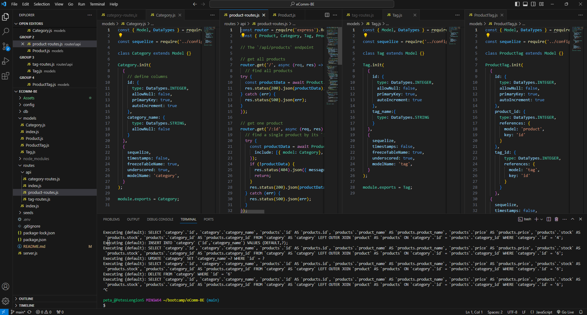
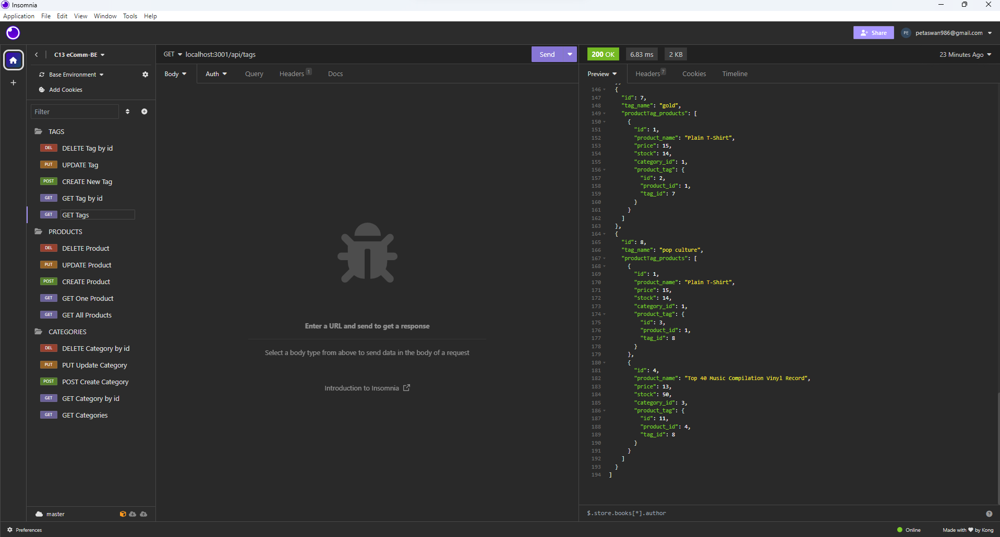

# eComm-BE

  ## Description
  The aim of this project was to use existing starter code to build the back-end of an e-commerce site. 
  The app uses Express.js, MySQL, Sequelize and dotenv.

  ## Table of Contents
  * [Description](#description)
  * [Installation](#installation)
  * [Usage](#usage)
  * [Licenses](#licenses)
  * [Contributing](#how-to-contribute)
  * [Tests](#tests)
  * [Questions/Contact Info](#questionscontacts)
  * [Credits](#credits)

  ## Installation
  1. Clone the code from this repository
  2. Open the project in VS Code (or similar) and install npm dependancies 
  3. Run db files through mysql before running main code in your terminal
  4. Open server link in Insomnia to test different routes and create, update or delete data in the database

  ## Usage
  Screenshots, GIF and Walkthrough link are below...
  
  
  
  
   ### Link to Video demonstration (https://clipchamp.com/watch/Myr5jfaJRHf)

  ## Licenses
  This project is covered under the MIT license.
  To learn more about what this means, click the license button at the top.

  ## How to contribute
   Contact me via the details below

  ## Tests
  N/A

  ## Questions/Contacts
  Have questions about this project?  
  GitHub: https://github.com/Petarlo 
  Email: petaswan986@gmail.com  

  ## Credits
  N/A

